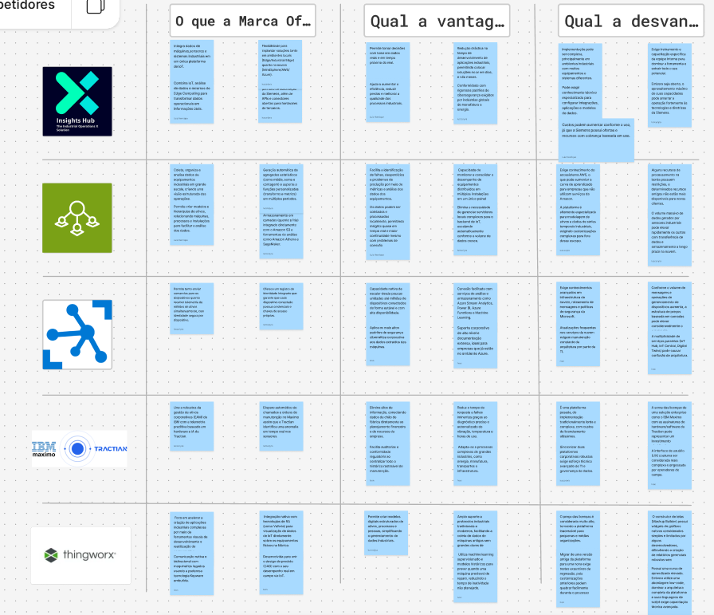

# Análise Detalhada das Plataformas de IoT e Gestão de Ativos Industriais

Abaixo estão apresentados o funcionamento, os pontos fortes e os pontos fracos de cada uma das cinco plataformas avaliadas na matriz comparativa, considerando sua integração com o chão de fábrica, recursos de IA, gêmeos digitais e automação.

---

### 1. Insights Hub (Siemens)

 **Funcionamento:** Antigo *MindSphere*, o **Insights Hub** é a solução de IoT industrial da Siemens integrada ao ecossistema Xcelerator. Atua conectando ativos do chão de fábrica (PLCs, sensores, máquinas) por meio de gateways industriais (*MindConnect*) ou *Siemens Industrial Edge*, coletando dados em tempo real, estruturando gêmeos digitais e fornecendo dashboards analíticos.
 **Pontos Fortes:**
   **Integração Nativa Robusta:** Conexão fluida com o hardware da Siemens e padrões industriais tradicionais.
   **Modelagem de Ativos (Digital Twin):** Excelente representação hierárquica e estruturada de ativos e processos complexos.
   **Flexibilidade Multi-cloud:** Capacidade de operação híbrida, local ou em diferentes provedores de nuvem.
***Pontos Fracos:**
   **Ferramentas Low-Code Limitadas:** Não oferece um ambiente nativo avançado de desenvolvimento *low-code* voltado para criação rápida de aplicações customizadas.
   **Ausência de EAM Nativo:** Não realiza a automação direta de ordens de serviço, exigindo integração com sistemas externos de manutenção.
   **Realidade Aumentada (AR):** Recursos de RA não são nativos na plataforma principal.

---

### 2. AWS IoT SiteWise

 **Funcionamento:** Serviço gerenciado da Amazon Web Services projetado para coletar, armazenar, estruturar e monitorar dados de equipamentos industriais em escala global. Utiliza gateways de borda (*AWS IoT Greengrass*) para extrair dados de servidores OPC-UA e enviá-los para a nuvem AWS, onde são modelados e visualizados através do *SiteWise Monitor*.
 **Pontos Fortes:**
   **Escalabilidade Enterprise Global:** Arquitetura de nuvem extremamente robusta capaz de gerenciar volumes massivos de dados de múltiplas plantas.
   **Painéis Prontos:** O *SiteWise Monitor* entrega interfaces e dashboards intuitivos rapidamente.
   **Monitoramento Preditivo com IA:** Integração facilitada com serviços de Machine Learning da AWS (como o *Amazon Lookout for Equipment*).
***Pontos Fracos:**
   **Ecossistema Fechado (Vendor Lock-in):** Baixa flexibilidade para arquiteturas *multi-cloud* ou ambientes locais independentes.
   **Protocolos Industriais Nativos Limitados:** Requer adaptadores adicionais via *Greengrass* para cobrir uma gama ampla de protocolos legados.
   **Foco Restrito:** Não possui ferramentas *low-code*, EAM ou RA integradas.

---

### 3. Azure IoT Hub

 **Funcionamento:** Plataforma de infraestrutura gerenciada pela Microsoft que atua como um hub central de mensagens bidirecionais entre aplicativos de IoT e os dispositivos conectados. Funciona como uma camada de conectividade segura e gerenciamento de dispositivos, servindo de base para arquiteturas de IoT mais amplas na nuvem Azure.
**Pontos Fortes:**
   **Conectividade e Protocolos:** Excelente suporte a protocolos de comunicação padrão e gerenciamento seguro de milhões de dispositivos conectados.
   **Escalabilidade Corporativa:** Infraestrutura global altamente confiável e segura da Microsoft Azure.
 **Pontos Fracos:**
   **Foco em Infraestrutura (PaaS):** Por ser primariamente um hub de conectividade, carece de recursos prontos como modelagem avançada de gêmeos digitais industriais, IA preditiva nativa ou dashboards industriais sem o uso de serviços complementares (como *Azure Digital Twins*).
   **Ausência de Recursos Operacionais:** Não dispõe de ferramentas *low-code*, automação de ordens de serviço (EAM) ou RA integradas.

---

### 4. IBM Maximo + Tractian

 **Funcionamento:** Combinação estratégica que une o **IBM Maximo** (líder global em *Enterprise Asset Management* - EAM) com a tecnologia de monitoramento preditivo plug-and-play da **Tractian** (sensores IoT e software de IA). A solução integra o monitoramento de vibração, temperatura e saúde dos ativos em tempo real com a gestão avançada de ordens de serviço e manutenção.
***Pontos Fortes:**
 
   **Automação de Ordens de Serviço (EAM):** Diferencial crítico. A detecção de anomalias gera ordens de serviço automáticas no sistema de manutenção corporativa.
   **IA Preditiva Avançada:** Combinação excelente de algoritmos especializados em prever falhas mecânicas e elétricas.
   **Chão de Fábrica e Gêmeos:** Forte capacidade de integração com ativos industriais físicos e representação digital de saúde.
***Pontos Fracos:**
   **Desenvolvimento Customizado:** Não é uma plataforma voltada para desenvolvimento *low-code* de aplicações genéricas.
   **Realidade Aumentada:** Não possui recursos nativos robustos de RA para suporte operacional em campo.
   **Ecossistema Acoplado:** Depende da sinergia específica entre as ferramentas IBM e Tractian.

---

### 5. ThingWorx (PTC)

  **Funcionamento:**

 Plataforma líder de IoT Industrial (IIoT) e AR desenvolvida especificamente para a transformação digital industrial. Oferece um ambiente completo de desenvolvimento *low-code* para criar aplicações, modelar gêmeos digitais complexos, conectar sistemas heterogêneos e integrar recursos visuais avançados.

* **Pontos Fortes:**
  * **Ferramentas Low-Code Líderes:** Permite construir e implantar aplicações industriais customizadas com extrema rapidez e agilidade.
  * **Realidade Aumentada (AR) Nativa:** Integração única com a tecnologia *Vuforia*, permitindo sobrepor dados de IoT e instruções de trabalho em 3D sobre os ativos físicos.
  * **Versatilidade e Conectividade:** Amplo suporte a protocolos industriais, múltiplos ambientes de nuvem e modelagem avançada de gêmeos digitais.
* **Pontos Fracos:**
  * **Ausência de EAM Nativo:** Não possui um sistema de gestão de manutenção corporativa integrado de fábrica, exigindo a integração com softwares terceiros (como SAP ou IBM Maximo) para automação de ordens de serviço.

# Matriz Comparativa: Plataformas de IoT e Gestão de Ativos Industriais

| Critérios / Tópicos | Insights Hub (Siemens) | AWS IoT SiteWise | Azure IoT Hub | IBM Maximo + Tractian | ThingWorx (PTC) |
| :--- | :---: | :---: | :---: | :---: | :---: |
| **Integração Nativa com Chão de Fábrica** | ✅ | ✅ | ✅ | ✅ | ✅ |
| **Monitoramento Preditivo Baseado em IA** | ✅ | ✅ | ❌ | ✅ | ✅ |
| **Modelagem de Ativos (Digital Twin)** | ✅ | ✅ | ❌ | ✅ | ✅ |
| **Suporte a Múltiplos Protocolos Industriais** | ✅ | ❌ | ✅ | ✅ | ✅ |
| **Ecossistema de Nuvem Flexível / Multi-cloud** | ✅ | ❌ | ❌ | ✅ | ✅ |
| **Ferramentas Low-Code para Desenvolvimento** | ❌ | ❌ | ❌ | ❌ | ✅ |
| **Automação de Ordens de Serviço (EAM)** | ❌ | ❌ | ❌ | ✅ | ❌ |
| **Realidade Aumentada (AR) Integrada** | ❌ | ❌ | ❌ | ❌ | ✅ |
| **Painéis de Visualização Prontos (Dashboard)** | ✅ | ✅ | ❌ | ✅ | ✅ |
| **Escalabilidade Enterprise Global** | ✅ | ✅ | ✅ | ✅ | ✅ |

---

### Detalhamento dos Tópicos Avaliados:

1. *Integração Nativa com Chão de Fábrica:* Capacidade de conectar diretamente com PLCs, sensores e hardwares industriais tradicionais.
2. *Monitoramento Preditivo Baseado em IA:* Uso de inteligência artificial para detectar anomalias e prever falhas em tempo real.
3. *Modelagem de Ativos (Digital Twin):* Criação de hierarquias e representações digitais estruturadas dos equipamentos e processos.
4. *Suporte a Múltiplos Protocolos Industriais:* Compatibilidade com padrões como OPC-UA, MQTT, Modbus, entre outros.
5. *Ecossistema de Nuvem Flexível / Multi-cloud:* Flexibilidade para rodar em ambientes híbridos, locais ou em diferentes provedores de nuvem.
6. *Ferramentas Low-Code para Desenvolvimento:* Facilidade para criar aplicações industriais customizadas sem necessidade de programação pesada.
7. *Automação de Ordens de Serviço (EAM):* Integração direta com sistemas de gestão de manutenção corporativa para abertura automática de chamados.
8. *Realidade Aumentada (AR) Integrada:* Visualização de dados e métricas de IoT sobrepostos aos ativos físicos através de RA.
9. *Painéis de Visualização Prontos (Dashboard):* Disponibilidade de interfaces gráficas intuitivas para acompanhamento imediato de KPIs.
10. *Escalabilidade Enterprise Global:* Capacidade comprovada de gerenciar grandes volumes de dados distribuídos em múltiplas plantas industriais.
# Requisitos Não Lineares / Casos de Uso Industriais

Conforme ilustrado nos cartões de requisitos estratégicos abaixo, o sistema deve atender a fluxos operacionais avançados que combinam IoT, IA e gestão de manutenção:

> ### 1. Automação de Ordens de Serviço
> Criar fluxos onde os alertas gerados pela IoT acionem automaticamente ordens de serviço e chamados de manutenção sem intervenção manual.

> ### 2. Centralização e Visibilidade Global
> Consolidar dados de diferentes marcas e hardwares em um único painel centralizado para eliminar silos de informação entre plantas industriais.

> ### 3. Manutenção Preditiva Baseada em IA
> Utilizar modelos de inteligência artificial sobre os dados coletados para prever a vida útil restante dos componentes críticos com maior precisão.

> ### 4. Suporte Operacional com Realidade Aumentada (AR)
> Implementar interfaces de realidade aumentada para sobrepor métricas em tempo real e instruções de montagem/manutenção diretamente sobre os ativos.

---

## Descrição Detalhada dos Requisitos Não Lineares

1. **Automação de Ordens de Serviço (EAM Integration):** Foco em eliminar o tempo de resposta humano entre a detecção de uma anomalia pelo sensor e a abertura do chamado no sistema de gestão de manutenção.
2. **Consolidação e Visibilidade Centralizada:** Quebra de silos operacionais, permitindo a ingestão heterogênea de dados industriais de múltiplos fornecedores em um dashboard unificado.
3. **Manutenção Preditiva com Machine Learning:** Aplicação de algoritmos avançados para prognóstico de falhas, saindo do modelo reativo ou preventivo baseado apenas em tempo de uso.
4. **Integração com Realidade Aumentada (AR) em Campo:** Capaz de acelerar o diagnóstico e a intervenção técnica em campo através de sobreposição visual de dados de IoT e manuais em 3D.
