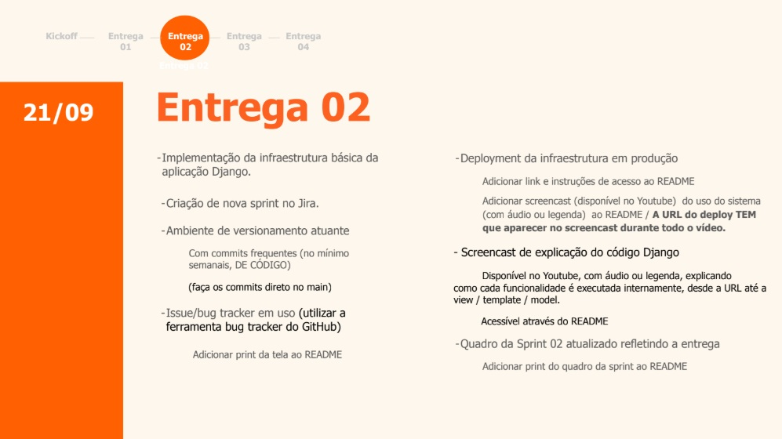

# Projeto Nexus
Repositório destinado ao projetos 2

## Primeira Entrega

Relatório da analise de competidores:

## Segunda Entrega

## Views do Sistema
Exibe o formulário de contato (contato.html) e renderiza a pagina inical (home.html)
* Se receber um formulário via POST, salva os campos (nome, email, assunto, mensagem) no banco de dados (MensagemContato)

## Dashboard de Custos
Busca os dados no banco de dados (EconomiaIoT) e gera gráficos comparativos usando a biblioteca Plotly.
* Ela funciona somando os custos operacionais (Energia, Manutenção e Paradas) nos cenários Com IoT e Sem IoT, e apartir disso calcula o valor economizado e a porcentagem total de redução.

## Simulador Financeiro
Simula o comportamento financeiro da fábrica ao longo de determinados dias para prever a economia com a instalação de sensores IoT.
* Ela recebe o número de máquinas, o custo por hora parada e o valor do sensor (ou usa valores padrão), ultilizase de Numpy simular horas de paradas diárias com variação realista, também considerando que a tecnologia IoT reduz as paradas inesperadas em 75% e organiza os dados em uma tabela com o Pandas, assim calculando a economia estimada no mês e o Retorno sobre o Investimento (ROI): ROI = (Economia Mensal / Custo Total dos Sensores) * 100

## Tecnologias e Bibliotecas Utilizadas
- **Django:** Framework web para renderização das views e integração com banco de dados.

- **Plotly:** Geração de gráficos interativos para renderização direta em HTML.

- **NumPy:** Geração de distribuições normais estocásticas para simulação realista de paradas.

- **Pandas:** Estruturação e manipulação de séries temporais de dados simulados.